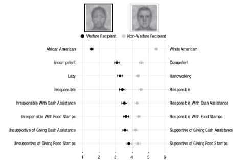

<!-- Replication reports should all use this template to standardize reporting across projects.  These reports will be public supplementary materials that accompany the summary report(s) of the aggregate results. -->

## Introduction

### Justification for Choice of Experiment:
This study provides evidence of a correlation between racially biased mental images of welfare recipients and support for welfare distribution. This is an important finding in the context of understanding how racial bias impacts institutional decisions, which I plan to explore throughout my research program. Through this replication, I will gain more understanding of how implicit associations about race can affect one's attitudes toward various laws and policies. 

### Description of Paper:
In the first two studies in the paper (Brown-Iannuzzi, Dotsch, Cooley, & Payne, 2017), participants selected welfare recipients and non-welfare recipients from a series of face images, and their selections were combined to create an average welfare-recipient and average non-welfare-recipient face. A separate sample rated the average welfare-recipient as appearing significantly more African-American than the non-welfare-recipient. I plan to replicate Study 3, in which participants were significantly less likely to award welfare benefits to the average welfare-recipient (more African-American appearing) image. 

### Description of the stimuli and procedures that will be required to conduct this experiment:
Participants will be recruited on Amazon Mechanical Turk (exact sample size to be determined by power analysis) to complete the study via Qualtrics. Face images used in Study 3 (2 representative images and 4 filler images) will be collected from the original authors for use. 

Measures for each face image will include:

-Perceived race

-Perceived competence

-Perceived degree of hardworking

-Perceived responsibility

-Perceived ability to use food stamps/cash assistance responsibly

-Support for giving person food stamps/cash assistance


General measures will include:

-Demographics (age, gender, race, income, education, political affiliation)


### Anticipated challenges
Potential challenges could include acquiring the images from the original authors, and finding alternative images if unable to get the original images. 

### Links
Project Repository: https://github.com/psych251/brown-iannuzzi2017

Original Paper: https://github.com/psych251/brown-iannuzzi2017/blob/master/original_paper/Brown-Iannuzzi%20et%20al%202017.pdf 

Qualtrics Paradigm: https://stanforduniversity.qualtrics.com/jfe/form/SV_7NWiDNodo4C7rSJ 

Preregistration: https://osf.io/acf5n 


## Methods

### Power Analysis

The hypotheses are that participants would rate the average welfare recipient image as less responsible in general, less responsible with cash assistance/food stamps, and would be less supportive of giving cash assistance/food stamps to this person than the average non-welfare recipient. These hypotheses were confirmed in the original study. The original effect sizes for each of the 5 DVs of interest were as follows:

Responsible: .31

Responsible with Cash Assistance: .19

Responsible with Food Stamps: .22

Supportive of giving Cash Assistance: .13

Supportive of giving Food Stamps: .13


Power analysis in G*Power reveals that to replicate the smallest effect (difference of average support for cash assistance/food stamps between two images = .13) at 80% power, we need a sample size of n=77, and to replicaate the largest effect (difference of mean responsiblity rating between the two images = .31) we need a sample of n=29. Based on funding constraints, we will collect a sample of 29 participants, and our key DV of interest will be that with the biggest effect size: the difference in mean ratings of responsibility for the welfare and non-welfare images. 


### Planned Sample

The original study sampled 229 participants on Amazon Mechanical Turk, although the power analysis done by the orignal authors suggested 90 participants were needed to detect a small effect size at 80% power. Subsequently larger effect sizes were found, thus we are able to collect a smaller sample to replicate larger effects. Our sample size will be based on the effect size of the "responsible" DV, which we will aim to replicate with 29 participants (based on power analysis). The study will be terminated on mTurk once I have collected full data from 29 participants. There are no demographic quotas or preselection rules, but if participants fail the attention check I will analyze the data with and without those participants to determine how this affects the results. 


### Materials

"Participants were told that they would see a series of “fuzzy” images of real people. The images presented were the average welfare-recipient and non-welfare-recipient images generated in Study 2 and four filler images (the same filler images used in Study 1 and 2), which were included so that the comparison between the two images of interest would not be salient."
Note: the filler images used in this replication will be different from those used in the original study; this should not affect results.


### Procedure	

"Participants were told that they would see a series of “fuzzy” images of real people. The blurry nature of the images was explained by telling participants that the images looked distorted because they were composites of photos of people who had applied for government welfare programs. Participants were told that some of the applicants turned out to be responsible recipients of welfare benefits, whereas others were irresponsible recipients of the benefits. Then, participants were asked to make a series of judgments about each image. They were given no indication whether each image was supposedly a composite of responsible or irresponsible welfare recipients."

"Participants rated each image on perceived race (1 = definitely African American, 6 = definitely White American). We measured perceived deservingness by asking participants to rate each image on the degree to which the pictured person seemed competent (1 = extremely unintelligent, 6 = extremely intelligent) and hardworking (1 = extremely lazy, 6 = extremely hardworking), the extent to which the pictured person seemed responsible (1 = extremely irresponsible, 6 = extremely responsible), and the extent to which they believed the pictured person would use food stamps responsibly (1 = definitely would not use responsibly, 6 = definitely would use responsibly) and would use cash assistance responsibly (1 = definitely would not use responsibly, 6 = definitely would use responsibly). Finally, participants were asked how much they would support giving the pictured person food stamps (1 = completely unsupportive, 6 = completely supportive) and cash assistance (1 = completely unsupportive, 6 = completely supportive). Participants also answered demographic questions, including questions about their gender, age, and race-ethnicity."


### Analysis Plan

A one-way MANOVA will be calculated to determine the effect of the welfare-recipient and non-welfare-recipient images on each of the following ratings:

-Responsibility (in general)

-Responsiblity with cash assistance 

-Responsbility with food stamps

-Supportiveness of giving cash assistance

-Supportiveness of giving food stamps

The one-way MANOVA will account for the multiple dependent variables. Then, assuming significance, a one-way ANOVA and partial eta-squared statistic will be calculated for each of the above ratings to measure individual effect sizes, as done in the original study. The key statistic is the F statistic and p value for the key variable of interest, responsibility.

Note: Given the determined sample size, the key variable of interest will be responsibility, but I will analyze the other DVs as well. 


### Differences from Original Study

The replication will use a smaller sample than the original study, though should have enough power to detect the specified effect based on the power analysis. The replication will use the same materials and procedure, with the exception of the filler images, which should not have an effect on the results since they will not be compared to the critical images.


#### Actual Sample
  The sample is 29 MTurk workers in the United States. No exclusions were made based on the predetermined criteria, which required all participants to pass the attention check. The mean age was 33.69. 72.4% of participants identify as male, and 27.6% identify as female. 65.52% of participants were White, 10.34% Black, 10.34% Hispanic, 6.9% Asian, and 6.9% both White and Hispanic. The median income of the sample was $40,000 - $49,999. 

#### Differences from pre-data collection methods plan
  None

## Results

### Data preparation

```{r}
#### Load Relevant Libraries and Functions
library(tidyverse)
library(knitr)
library(qualtRics)
library(lsr)
library(psych)

#### Import data
padata <- readSurvey("FinalData.csv")
View(padata)

#### Data exclusion / filtering
padata <- padata %>%
  filter(Finished == 1) %>%
  filter(att_check == 1)

#### Demographics
mean_age <- mean(padata$Age)
padata$Gender <- ifelse(padata$Gender == 1, "Male", "Female")
gender <- table(padata$Gender)
padata$Race <- ifelse(padata$Race == 1, "White", ifelse(padata$Race == 2, "Hispanic", ifelse(padata$Race == 3, "Black", ifelse(padata$Race == 4, "Native American", ifelse(padata$Race == 5, "Asian", ifelse(padata$Race == 6, "Other", "White and Hispanic"))))))
race <- table(padata$Race)
income <- median(padata$Income)

#### Eliminating unnecessary columns
padata <- padata %>% 
  select(starts_with("W"),
         starts_with("NW"))
padata <- padata %>%
  select(-White_F1, -White_F2, -White_F3, -White_F4)

#### Prepare data for analysis - create columns etc.
padata <- padata %>%
  mutate(subid = row_number())
padata_long <- padata %>%
  gather(measure, rating, W_White:NW_CashS)
View(padata_long)
padata_long$rating <- as.numeric(padata_long$rating)
padata_long <- padata_long %>%
  separate(measure, 
           c("image", "measure"))

padata_spread <- padata_long %>%
  spread(measure, rating)
View(padata_spread)
padata_spread$image <- as.factor(padata_spread$image)

```

### Confirmatory analysis

#### One-way MANOVA
```{r}
measures_combined <- cbind(padata_spread$Response, padata_spread$CashR, padata_spread$FoodR, padata_spread$CashS, padata_spread$FoodS) #combining DVs into single column
pamodel <- manova(measures_combined ~ image, data = padata_spread) #run MANOVA
summary(pamodel) #view MANOVA to determine significance

```

#### One-way ANOVA & Partial eta-squared
```{r}
#DV 1: Responsibility (general)
response.aov <- aov(Response ~ image, data = padata_spread)
summary(response.aov)
etaSquared(response.aov)

#DV 2: Responsbility with cash assistance
cashR.aov <- aov(CashR ~ image, data = padata_spread)
summary(cashR.aov)
etaSquared(cashR.aov)

#DV 3: Responsbility with food stamps
foodR.aov <- aov(FoodR ~ image, data = padata_spread)
summary(foodR.aov)
etaSquared(foodR.aov)

#DV 4: Support for giving cash assistance
cashS.aov <- aov(CashS ~ image, data = padata_spread)
summary(cashS.aov)
etaSquared(cashS.aov)

#DV 5: Support for giving food stamps
foodS.aov <- aov(FoodS ~ image, data = padata_spread)
summary(foodS.aov)
etaSquared(foodS.aov)

#DV 6: Hardworking
hardwork.aov <- aov(Hardwork ~ image, data = padata_spread)
summary(hardwork.aov)
etaSquared(hardwork.aov)

#DV 7: Smart
smart.aov <- aov(Smart ~ image, data = padata_spread)
summary(smart.aov)
etaSquared(smart.aov)

#DV 8: White
white.aov <- aov(White ~ image, data = padata_spread)
summary(white.aov)
etaSquared(white.aov)

```

```{r}
#Replicate graph of means

means <- padata_spread %>%
  group_by(image) %>%
  summarise(mean_CashR = mean(CashR),
            mean_CashS = mean(CashS),
            mean_FoodR = mean(FoodR),
            mean_FoodS = mean(FoodS),
            mean_Hardwork = mean(Hardwork),
            mean_Response = mean(Response),
            mean_Smart = mean(Smart),
            mean_White = mean(White))
means$mean_CashR <- round(means$mean_CashR, digits = 2)
means <- means %>% 
  mutate_at(2:9, round, 2)

means_t <- t(means)
means_t <- as.data.frame(means_t)
colnames(means_t) <- c("NW", "W")
means_t = means_t[-1, ]  
means_t <- means_t[,c(2, 1)]
means_tbl <- means_t %>%
  mutate(DV = c("CashR", "CashS", "FoodR", "FoodS", "Hardwork", "Response", "Smart", "White"))
means_tbl <- means_tbl %>%
  gather(image, mean, W, NW)
means_tbl$mean <- as.numeric(as.character(means_tbl$mean))

ggplot(means_tbl, aes(mean, DV)) +
  geom_point(aes(color=image), size = 3) +
  theme(axis.text=element_text(size=14, face="bold"),
        axis.title=element_text(size=14,face="bold"),
        legend.text = element_text(size=14)) +
  scale_color_hue(labels = c("Non-Welfare", "Welfare"))

```



```{r}
#Table comparing means/effect sizes across original study and replication 

colnames(means_t) <- c("Welfare Rep", "NonWelfare Rep")
resulttable <- means_t %>%
  mutate("DV" = c("CashR", "CashS", "FoodR", "FoodS", "Hardworking", "Responsible", "Smart", "White"))    %>% mutate("Welfare Orig" = c(3.53, 3.57, 3.63, 3.81, 3.26, 3.41, 3.08, 1.54)) %>%
  mutate("NonWelfare Orig" = c(4.29, 4.19, 4.40, 4.36, 4.34, 4.54, 4.56, 5.44)) %>%
  mutate("Partial Eta Squared Orig" = c(.19, .13, .22, .13, .32, .31, .52, .92)) %>%
  mutate("Partial Eta Squared Rep" = c(.18, .12, .20, .13, .15, .23, .15, .93))

resulttable <- resulttable[c("DV", "NonWelfare Orig", "NonWelfare Rep", "Welfare Orig", "Welfare Rep", "Partial Eta Squared Orig", "Partial Eta Squared Rep")]
resulttable

```


### Exploratory analyses

See above for exploratory analyses of other DVs

## Discussion

### Summary of Replication Attempt
My replication of Study 3 was a partial success; the effect was replicated for the DV of interest (responsibility), although it was not as large an effect as in the original study. Specifically, the data showed a significant difference in responsbility ratings for the non-welfare and welfare recipient images with a partial eta-squared of .23, smaller than the original partial eta-squared of .31. After completing an ANOVA for responsbility ratings, the F value obtained (16.72) was significant at p < .001 (the F and p values were not reported in the original paper).

### Commentary
Further analyses reveal a similar pattern of results for the additional DVs as in the original paper. The replication data show a significant difference in responsbility with cash assistance (partial eta-squared = .18, p < .001) responsbility with food stamps (partial eta-squared = .20, p < .001), support for cash assistance (partial eta-squared = .12, p = .007), support for food stamps (partial eta-squared = .13, p = .005), hardworking (partial eta-squared = .15, p = .002), smart (partial eta-squared = .15, p = .002), and white (partial eta-squared = .93, p < .001). Given that the sample was not large enough to expect to replicate these findings based on their effect sizes in the original paper, this is promising evidence that these effects might be more robust in a larger replication. Additionally, the original authors might suggest that the responsibility effect would be larger in a larger sample, since our sample was much smaller than theirs (n=229). Overall, the pattern of results holds consistent, which is promising evidence for these effects. 

